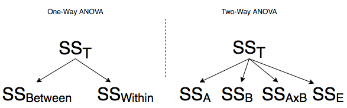

```{r setup, include=FALSE}
knitr::opts_chunk$set(echo = TRUE, fig.align="center",warning=FALSE, message=FALSE)
library(knitr)
hook_output <- knit_hooks$get("output")
knit_hooks$set(output = function(x, options) {
  lines <- options$output.lines
  if (is.null(lines)) {
    return(hook_output(x, options))  # pass to default hook
  }
  x <- unlist(strsplit(x, "\n"))
  more <- "..."
  if (length(lines)==1) {        # first n lines
    if (length(x) > lines) {
      # truncate the output, but add ....
      x <- c(head(x, lines), more)
    }
  } else {
    x <- c(more, x[lines], more)
  }
  # paste these lines together
  x <- paste(c(x, ""), collapse = "\n")
  hook_output(x, options)
})

format_cells <- function(df, rows ,cols, value = c("italics", "italics2", "bold", "strikethrough","bold italics")){

  # select the correct markup
  map <- setNames(c("*","_", "**", "~~","***"), c("italics","italics2", "bold", "strikethrough","bold italics"))
  markup <- map[value]  

  for (r in rows){
    for(c in cols){

      # Make sure values are not factors
      df[[c]] <- as.character( df[[c]])

      # Update formatting
      df[r, c] <- paste0(markup, df[r, c], markup)
    }
  }

  return(df)
}
``` 

Hey y'all! Welp, this isn't really a *basic* topic, and it will probably be my last "Stats U Need" post, but I did promise a follow-up to our discussion of [one-way ANOVA](http://www.nathanielwoodward.com/2017/08/27/basic-stats-u-need-3-anova/). We will mostly be focused on how to perform this in R, but fear not! We will deal conceptually and computationally about sums of squares calculations, interactions, ...all the good stuff!

I also want to take the time to address two annoying issues with more complex ANOVAs: the three types of sums of squares (I/II/III) and setting contrasts for linear models in R.

# Two-Way ANOVA

- Simultaneously tests effects of two categorical explanatory variables ("factors") on a numeric response variable
- Test the effect of Factor A controlling for Factor B (and vice versa)
- Test interaction between Factors A and B

- Each factor/interaction has its own set of **hypotheses**
- Each factor/interaction has its own **F-statistic**
- Each factor/interaction has its own **p-value**

- An interaction tests if the effect of one factor on the response differs across levels of the other factor (this will make sense shortly)

## Assumptions

1. Random sample, independent observations
2. Each group within each factor is roughly normal (or $n>25$)
3. Each group within each factor has equal variance 

To assess normality, look at boxplots, histograms, qq-plots for each group 

To assess homoskedasticity, use Levene's test or look at sample variances ($\forall i,j: s_i^2 < 4s_j^2$), boxplots


## Partitioning the Total Sum of Squares ($SS_T$)



- One-Way ANOVA, **two** sources of variation: between-groups, within-groups/error

- Two-Way ANOVA, **four** sources: factor A, factor B, A$\times$B interaction, within-cell/error

- For a two-way ANOVA, $SS_T=SS_A+SS_B+SS_{A\times B}+SS_E$
- If you know four of these, you can solve for the other

## Two-Way ANOVA Table

This is a two-way ANOVA table. It should look almost exactly the same as a one-way ANOVA table except for the fact that here we have two additional rows: one for the main effect of the second factor, and one for the interaction. Notice that we will be conducting three different F-tests, each with their own degrees of freedom calculations.


|Source| SS | df | MS | F | 
|:---------|:-------|:-----------:|:------------------|:----|
|Factor A | $SS_A$ | $a-1$ | $MS_A=\frac{SS_A}{a-1}$ | $\frac{MS_A}{MS_E}$|
|Factor B | $SS_B$ | $b-1$ | $MS_B=\frac{SS_B}{b-1}$| $\frac{MS_B}{MS_E}$  |
|A$\times$B | $SS_{AB}$ | $(a-1)(b-1)$ | $MS_{AB}=\frac{SS_{AB}}{(a-1)(b-1)}$ | $\frac{MS_{A\times B}}{MS_E}$    |
|Error | $SS_E$ | $N-ab$ | $MS_E=\frac{SS_E}{N-ab}$     |        |
|Total | $SS_T$ | $N-1$ |       |       |


## Mechanics of Two-Way ANOVA

Below I illustrate the full cross of your two factors (A and B). The big dots used as subscripts for the means indicate the mean of your response variable averaged across the dotted factors. 

$$
\begin{array}{c|c|c|c|c|c}
& \mathbf{B_1} & \mathbf{B_2} & \dots & \mathbf{B_b} &  \\ \hline
\mathbf{A_1} & x_{_{1,1,1}},\dots,x_{_{1,1,r}} & x_{_{1,2,1}},\dots,x_{_{1,2,r}} & \dots & x_{_{1,b,1}},\dots,x_{_{1,3,r}} & \bar x_{1 \bullet \bullet} \\ \hline
\mathbf{A_2} & x_{_{2,1,1}},\dots,x_{_{2,1,r}} & x_{_{2,2,1}},\dots,x_{_{2,2,r}} & \dots & x_{_{2,b,1}},\dots,x_{_{2,3,r}} & \bar x_{2 \bullet \bullet} \\ \hline
\vdots & \vdots & \vdots & \ddots & \vdots & \vdots \\ \hline
\mathbf{A_a} & x_{_{a,1,1}},\dots,x_{_{2,1,r}} & x_{_{2,2,1}},\dots,x_{_{2,2,r}} & \dots & x_{_{2,3,1}},\dots,x_{_{2,3,r}} & \bar x_{a \bullet \bullet} \\ \hline
 & \bar x_{\bullet 1 \bullet} & \bar x_{\bullet 2 \bullet} & \dots & \bar x_{ \bullet b \bullet} & \bar x_{\bullet \bullet \bullet} \\
\end{array}
$$

- There are $a$ levels of factor $A$ (indexed by $i$)
- There are $b$ levels of factor $B$ (indexed by $j$)
- Thus, there are $a \times b$ cells (indexed by $k$) 
- Each cell contains $r$ observations
- Thus, there are a total of $N=a\times b \times r$ observations!

- Observation $x_{ijk}$ is the $k^{th}$ observation in row $i$ and column $j$
- $\bar x_{\bullet \bullet \bullet}=$ grand mean; $\bar x_{i \bullet \bullet} =$ row $i$ mean; $\bar x_{ \bullet j \bullet} =$ column $j$ mean
- $\bar x_{ij\bullet}=$ cell $ij$ mean 


### Calculating the Sums of Squares by Hand

Below, I give formulas for calculating each of the sum-of-squares for two-way ANOVA, and then below I give a brief verbal description of what the formula is doing in terms of deviations.

- $\mathbf{SS_A}=r b \sum_i^a (\bar x_{i\bullet \bullet}-\bar x_{\bullet \bullet \bullet})^2$  
- Deviations of the means of Factor A from the grand mean

- $\mathbf{SS_B}=r a \sum_j^b (\bar x_{\bullet j \bullet}-\bar x_{\bullet \bullet \bullet})^2$ 
- Deviations of the means of Factor B from the grand mean

- $\mathbf{SS_{A\times B}}= r \sum_i^a \sum_j^b \overbrace{((\bar x_{i j \bullet }-\bar x_{\bullet \bullet \bullet})-(\bar x_{i\bullet \bullet}-\bar x_{\bullet \bullet \bullet})-(\bar x_{\bullet j \bullet}-\bar x_{\bullet \bullet \bullet}))^2}^{(\bar x_{i j \bullet }-\bar x_{i\bullet \bullet}-\bar x_{\bullet j \bullet}+\bar x_{\bullet \bullet \bullet})^2}$
- Deviations of the cell means from the grand mean, minus the effects of factors A and B

- $\mathbf{SS_W}=\sum_i^a \sum_j^b \sum_k^r (x_{ijk}-\bar x_{ij\bullet})^2$ 
- Deviations of the observations from their cell means

- $\mathbf{SS_T}=\sum_i^a \sum_j^b \sum_k^r (x_{ijk}-\bar x_{\bullet \bullet \bullet})^2$ 
- Deviations of the observations from the grand mean


### Cell Means

$$
\begin{array}{c|c|c|c|c|c}
& \mathbf{B_1} & \mathbf{B_2} & \dots & \mathbf{B_b} &  \\ \hline
\mathbf{A_1} & \bar x_{1,1 \bullet} & \bar x_{1,2 \bullet} & \dots & \bar x_{1,b \bullet} & \bar x_{1 \bullet \bullet} \\ \hline
\mathbf{A_2} & \bar x_{2,1 \bullet} & \bar x_{2,2 \bullet} & \dots & \bar x_{2,b \bullet} & \bar x_{2 \bullet \bullet} \\ \hline
\vdots & \vdots & \vdots & \ddots & \vdots & \vdots \\ \hline
\mathbf{A_a} & \bar x_{a,1 \bullet} & \bar x_{a,2 \bullet} & \dots & \bar x_{a,b \bullet} & \bar x_{a \bullet \bullet} \\ \hline
 & \bar x_{\bullet 1 \bullet} & \bar x_{\bullet 2 \bullet} & \dots & \bar x_{ \bullet b \bullet} & \bar x_{\bullet \bullet \bullet} \\
\end{array}
$$


## Interactions in Two-Way ANOVA: 8 Possibilities

- No effects
- Main effect of A
- Main effect of B
- Main effect of A and B
- A$\times$B Interaction, No main effects
- A$\times$B Interaction, Main effect of A
- A$\times$B Interaction, Main effect of B
- A$\times$B Interaction, Main effects of A and B

What follows is an interaction tutorial: I go through each of these scenarios in turn using two made-up factors: *Age* (Adolescent vs. Adult) and *Condition* (Treatment vs. Control). Assume the response variable is something like a quality-of-life score. We will examine the main effect of each of the two factors, as well as the effect of their interaction, on this response variable. 


### 1. No Interactions, No Main Effects

- Notice that each dot corresponds to a cell mean
- No differences in cell means or group means (they are overlapping)

```{R}
library(dplyr)
library(tidyr)
library(ggplot2)


intdat<-data.frame(Condition=c("Treatment","Treatment","Control","Control"), Age=c("Adolescent","Adult","Adolescent","Adult"),Outcome=c(3,3,3,3))
intdat$Condition<-as.character(intdat$Condition)

wide<-spread(data=intdat, Age, Outcome)
tab1<-cbind(wide," "=rowMeans(wide[,-1]))
rbind(tab1,c("",colMeans(tab1[,-1])))%>%format_cells(3,2:3, "bold")%>%format_cells(1:2,4, "bold")%>%format_cells(3,4, "bold") %>%knitr::kable(.,align = 'lccc')

ggplot(intdat,aes(x=Condition,y=Outcome,color=Age,lty=Age))+
  geom_line(aes(group=Age),size=1)+
  geom_point()+scale_y_continuous(limits=c(1,5))
```

### 2. No Interaction, Main Effect of Treatment

```{R}
intdat<-data.frame(Condition=c("Treatment","Treatment","Control","Control"), Age=c("Adolescent","Adult","Adolescent","Adult"),Outcome=c(4,4,2,2))
intdat$Condition<-as.character(intdat$Condition)

wide<-spread(data=intdat, Age, Outcome)
tab1<-cbind(wide," "=rowMeans(wide[,-1]))
rbind(tab1,c("",colMeans(tab1[,-1])))%>%format_cells(3,2:3, "bold")%>%format_cells(1:2,4, "bold")%>%format_cells(3,4, "bold") %>%knitr::kable(.,align = 'lccc')

ggplot(intdat,aes(x=Condition,y=Outcome,color=Age,lty=Age))+
  geom_line(aes(group=Age),size=1)+
  geom_point()+scale_y_continuous(limits=c(1,5))
```


### 3. No Interaction, Main Effect of Age

```{R}
intdat<-data.frame(Condition=c("Treatment","Treatment","Control","Control"), Age=c("Adolescent","Adult","Adolescent","Adult"),Outcome=c(4,2,4,2))
intdat$Condition<-as.character(intdat$Condition)

wide<-spread(data=intdat, Age, Outcome)
tab1<-cbind(wide," "=rowMeans(wide[,-1]))
rbind(tab1,c("",colMeans(tab1[,-1])))%>%format_cells(3,2:3, "bold")%>%format_cells(1:2,4, "bold")%>%format_cells(3,4, "bold") %>%knitr::kable(.,align = 'lccc')

ggplot(intdat,aes(x=Condition,y=Outcome,color=Age,lty=Age))+
  geom_line(aes(group=Age),size=1)+
  geom_point()+scale_y_continuous(limits=c(1,5))
```

- Notice that each dot corresponds to a cell mean!

### 4. No Interaction, Two Main Effects

```{R}
intdat<-data.frame(Condition=c("Treatment","Treatment","Control","Control"), Age=c("Adolescent","Adult","Adolescent","Adult"),Outcome=c(5,3,3,1))
intdat$Condition<-as.character(intdat$Condition)

wide<-spread(data=intdat, Age, Outcome)
tab1<-cbind(wide," "=rowMeans(wide[,-1]))
rbind(tab1,c("",colMeans(tab1[,-1])))%>%format_cells(3,2:3, "bold")%>%format_cells(1:2,4, "bold")%>%format_cells(3,4, "bold") %>%knitr::kable(.,align = 'lccc')

ggplot(intdat,aes(x=Condition,y=Outcome,color=Age,lty=Age))+
  geom_line(aes(group=Age),size=1)+
  geom_point()+scale_y_continuous(limits=c(1,5))
```


### 5. Interaction, No Main Effects

```{R}
intdat<-data.frame(Condition=c("Treatment","Treatment","Control","Control"), Age=c("Adolescent","Adult","Adolescent","Adult"),Outcome=c(2,4,4,2))
intdat$Condition<-as.character(intdat$Condition)

wide<-spread(data=intdat, Age, Outcome)
tab1<-cbind(wide," "=rowMeans(wide[,-1]))
rbind(tab1,c("",colMeans(tab1[,-1])))%>%format_cells(3,2:3, "bold")%>%format_cells(1:2,4, "bold")%>%format_cells(3,4, "bold") %>%knitr::kable(.,align = 'lccc')

ggplot(intdat,aes(x=Condition,y=Outcome,color=Age,lty=Age))+
  geom_line(aes(group=Age),size=1)+
  geom_point()+scale_y_continuous(limits=c(1,5))
```

### 6. Interaction and Main Effect of Treatment

```{R}
intdat<-data.frame(Condition=c("Treatment","Treatment","Control","Control"), Age=c("Adolescent","Adult","Adolescent","Adult"),Outcome=c(5,3,1,3))
intdat$Condition<-as.character(intdat$Condition)

wide<-spread(data=intdat, Age, Outcome)
tab1<-cbind(wide," "=rowMeans(wide[,-1]))
rbind(tab1,c("",colMeans(tab1[,-1])))%>%format_cells(3,2:3, "bold")%>%format_cells(1:2,4, "bold")%>%format_cells(3,4, "bold") %>%knitr::kable(.,align = 'lccc')

ggplot(intdat,aes(x=Condition,y=Outcome,color=Age,lty=Age))+
  geom_line(aes(group=Age),size=1)+
  geom_point()+scale_y_continuous(limits=c(1,5))
```

### 7. Interaction and Main Effect of Age

- Interaction is what's important, not main effect.

```{R}
intdat<-data.frame(Condition=c("Treatment","Treatment","Control","Control"), Age=c("Adolescent","Adult","Adolescent","Adult"),Outcome=c(5,1,3,3))
intdat$Condition<-as.character(intdat$Condition)

wide<-spread(data=intdat, Age, Outcome)
tab1<-cbind(wide," "=rowMeans(wide[,-1]))
rbind(tab1,c("",colMeans(tab1[,-1])))%>%format_cells(3,2:3, "bold")%>%format_cells(1:2,4, "bold")%>%format_cells(3,4, "bold") %>%knitr::kable(.,align = 'lccc')

ggplot(intdat,aes(x=Condition,y=Outcome,color=Age,lty=Age))+
  geom_line(aes(group=Age),size=1)+
  geom_point()+scale_y_continuous(limits=c(1,5))
```


### 8. Interaction and Both Main Effects

- The interaction is what's important, not main effect.

```{R}
intdat<-data.frame(Condition=c("Treatment","Treatment","Control","Control"), Age=c("Adolescent","Adult","Adolescent","Adult"),Outcome=c(5,1,1,1))
intdat$Condition<-as.character(intdat$Condition)

wide<-spread(data=intdat, Age, Outcome)
tab1<-cbind(wide," "=rowMeans(wide[,-1]))
rbind(tab1,c("",colMeans(tab1[,-1])))%>%format_cells(3,2:3, "bold")%>%format_cells(1:2,4, "bold")%>%format_cells(3,4, "bold") %>%knitr::kable(.,align = 'lccc')

ggplot(intdat,aes(x=Condition,y=Outcome,color=Age,lty=Age))+
  geom_line(aes(group=Age),size=1)+
  geom_point()+scale_y_continuous(limits=c(1,5))
```


### 8. Interaction and Both Main Effects (II)

- Main effect of age holds for both conditions, so it is interpretable

```{R}
intdat<-data.frame(Condition=c("Treatment","Treatment","Control","Control"), Age=c("Adolescent","Adult","Adolescent","Adult"),Outcome=c(5,1,3,1))
intdat$Condition<-as.character(intdat$Condition)

wide<-spread(data=intdat, Age, Outcome)
tab1<-cbind(wide," "=rowMeans(wide[,-1]))
rbind(tab1,c("",colMeans(tab1[,-1])))%>%format_cells(3,2:3, "bold")%>%format_cells(1:2,4, "bold")%>%format_cells(3,4, "bold") %>%knitr::kable(.,align = 'lccc')

ggplot(intdat,aes(x=Condition,y=Outcome,color=Age,lty=Age))+
  geom_line(aes(group=Age),size=1)+
  geom_point()+scale_y_continuous(limits=c(1,5))
```


# Full Example: Effect of Vitamin C on Guinea Pig Tooth Growth

This dataset comes preinstalled with base R. The explanatory variables/factors are `dose` of vitamin C (three levels: 0.5, 1, or 2 mg/day) and delivery method (`supp`: orange juice or a vitamin C supplement). The response is a measurement of tooth growth (`len`, numeric). Let's look at the data.

```{R}
gpigs<-ToothGrowth
gpigs$dose<-as.factor(gpigs$dose)

table(gpigs$supp,gpigs$dose)
```

It's a full-factorial design with ten guineas in each cross. Let's grab the means to make a table like the one above

```{R}
gpigs%>%group_by(supp,dose)%>%summarize(cellmean=mean(len))%>%spread(supp,cellmean)%>%
  rowwise()%>%mutate(mean=mean(c(OJ,VC)))%>%ungroup()%>%
  bind_rows(summarize_all(.,.funs=mean))
```


### Guinea Pig Tooth Growth Interaction Plot

```{R}
gpigs %>% group_by(supp,dose) %>%summarize(length = mean(len))%>%
ggplot() + aes(x = supp, y = length, color = dose) + geom_line(aes(group = dose)) + geom_point()
```

### Plot of the cell means (interaction plot)

Or plot them like this:
```{R}
gpigs %>% group_by(supp,dose) %>%summarize(length = mean(len))%>%
ggplot() + aes(x = dose, y = length, color = supp) + geom_line(aes(group = supp)) + geom_point()
```

### Hypotheses 

1. $H_0:$ No effect of supplement type: $\mu_{OJ}=\mu_{VC}$ \newline
$H_A:$ Effect of dose:  at least group mean one differs  
  
  
2. $H_0:$  No effect of dose: $\mu_{0.5mg}=\mu_{1mg}=\mu_{2mg}$ \newline
$H_A:$ Effect of dose:  at least group mean one differs  
  
  
3. $H_0:$  No $dose \times supplement$ interaction effect \newline
$H_A:$ There is a significant interaction


### Assumptions

```{R}
library(car)

fit<-lm(len ~ dose * supp, data=gpigs)
leveneTest(fit)

#normality looks OK
qplot(fit$residuals,bins=8)+xlab("Residuals") 
shapiro.test(fit$residuals)
```

## Sum of Squares Calculations 

### Sums of Squares for Supplement Type (OJ vs VC)

$$
\begin{aligned}
SS_{supp}&=rb\sum_i^{2}(\bar x_{i\bullet\bullet}-\bar x_{\bullet\bullet\bullet})^2\\
&=10*3*\sum_i^{2}(\bar x_{i\bullet\bullet}-18.813)^2\\
&=10*3*\left((20.663-18.813)^2+(16.963-18.813)^2\right)\\
&=205.35
\end{aligned}
$$

- Overall effect of supplement type:

```{R, echo=T}
fit<-lm(len ~ supp, data=gpigs)
Anova(fit)
```


### Sums of Squares for Dose (0.5, 1, or 2)

$$
\begin{aligned}
SS_{dose}&=ra\sum_j^{3}(\bar x_{\bullet j \bullet}-\bar x_{\bullet\bullet\bullet})^2\\
&=10\times 2\times \sum_j^{3}(\bar x_{\bullet j\bullet}-18.813)^2\\
&=20\times\left((10.605-18.813)^2+(19.735-18.813)^2+(26.1-18.813)^2\right)\\
&=2426.434
\end{aligned}
$$

- Overall effect of dose:

```{R, echo=T}
fit<-lm(len ~ dose, data=gpigs)
Anova(fit)
```

## Example: Two-Way ANOVA, no Interaction

- Effect of supplement type, *controlling for dose* (it's significant now!)
- Effect of dose, *controlling for supplement type*

```{R, echo=T}
fit<-lm(len ~ supp + dose, data=gpigs)
Anova(fit)
```

## Calculation of Dose $\times$ Supplement Interaction Effect

Shortcut: \pause \small

- $SS_{cells}=r\sum_i^a\sum_j^b(\bar x_{ij\bullet}-\bar x_{\bullet\bullet\bullet})^2$ \hfill (deviations of cell means around grand mean)
- $SS_{A\times B}=SS_{cells}-SS_{A}-SS_{B}$ \pause


$$
\begin{aligned}
SS_{cells}&=10\sum_i^2\sum_j^3(\bar x_{ij\bullet}-18.813)^2\\
&=10 \times ((13.23-18.813)^2+(22.7-18.813)^2+(26.06-18.813)^2+  \\
& \ \ \ \ \ \ ...(7.98-18.813)^2+(16.77-18.813)^2+(26.14-18.813)^2)\\
&=10\times (31.170+15.109+52.519+4.174+53.685)\\
&=2740.103
\end{aligned}
$$


>- $SS_{supp \times dose}=SS_{cells}-SS_{supp}-SS_{dose}$
>- $SS_{supp \times dose}=2740.103-205.35-2426.434=\mathbf{108.32}$

## Example: Two-Way ANOVA with Interaction

- Effect of $supplement$, controlling for dose
- Effect of $dose$, controlling for supplement
- Effect of $dose\times supp$

```{R, echo=T}
fit<-lm(len ~ supp + dose + supp:dose, data=gpigs) #or just len~supp*dose
Anova(fit)
```

---

```{R, echo=T}
#Here's a quick way to get all means
model.tables(aov(fit), type = "means")
```


## Full ANOVA table for Guinea Pig example

|Source| SS | df | MS | F | 
|:---------|:-------|:-----------:|:------------------|:----|
|dose | 2426.43 | 2 | $\frac{2426.43}{2}=1213.215$ | $\frac{1213.215}{13.18}=92.05$|
|supp | 205.35 | 1 | $\frac{205.35}{1}=205.35$| $\frac{205.35}{13.18}=15.58$   |
|dose$\times$supp | 108.32 | 2 | $\frac{108.32}{2}=54.16$ | $\frac{54.16}{13.18}=4.11$    |
|error | 712.11 | 54 | $\frac{712.11}{54}=13.18$     |        |
|total | 3452.21  |   59   |  |       |

>- Critical value for main effect of *dose*: $F^*_{(2,54)}= 3.16\overbrace{\approx 3.18}^{table\ F_{(2,50)}}$
>- Critical value for main effect of *supplement*: $F^*_{(1,54)}= 4.02\overbrace{\approx 4.03}^{table\ F_{(1,50)}}$
>- Critical value for interaction effect: $F^*_{(2,54)}= 3.16\overbrace{\approx 3.18}^{table\ F_{(2,50)}}$
>- **Decisions?**


## Post Hoc Tests (only do comparisons of interest!)

```{R}
TukeyHSD(aov(fit))
```

## $R^2$ ($\eta^2$)

$$
\begin{aligned}
R^2&=1-\frac{SS_E}{SS_T}\\
&=1-\frac{712.11}{205.35+2426.43+108.32+712.11}\\
&=1-\frac{712.11}{3452.21}\\
&=.794
\end{aligned}
$$

```{R echo=T}
summary(fit)$r.sq
summary(fit)$adj.r.sq
```

## Type I/II/III sums of squares

Since you are reading about two-way ANOVA, chances are good that you have come across the terms *Type I*, *Type II*, and *Type II* sums of squares. This issue does not effect one-way ANOVA, but when you have multiple factors competing to explain a pool of total variance, there are a few different ways you can do it. **When the design is balanced** (i.e., when you have a equal number of observations in each cell, as in the guinea pig data above), **the type of sums of squares** you use won't matter (they **will all be the same**; I'll show you why in a sec). However, in unbalanced designs, different sums of squares can lead to different F-tests, which can lead a factor to appear significant in some circumstances (e.g., using Type I SS), but not significant in others (e.g., using Type III SS). I'll show you an example of this as well. There is no *correct* way (it all depends on the question you want to ask), but you should certainly be aware of the distinction and report your results accordingly!

By way of an overview, Type I sums of squares are *sequential*. This 


Let's keep it simple and just use the `mtcars` dataset (if you are unfamiliar, run `?mtcars`). We will look to see whether the impact of two factors on a car's gas mileage: transmission type (`am`, automatic or manual) and number of cylinders. Notice the unbalanced design.

```{R}
cars<-mtcars%>%select(mpg,cyl,am)%>%mutate(cyl=as.factor(cyl),am=as.factor(am))

cars%>%count(cyl,am)
```

###Type I SS

By default, the `anova()` function in R will report Type I SS.

```{R}
options(contrasts=c("contr.sum","contr.poly")) #this will only affect type III; I'll explain shortly

fit12<-lm(mpg~am*cyl,data=cars)
fit21<-lm(mpg~cyl*am,data=cars)

anova(fit12)
anova(fit21)
```

Wow, vastly different answers depending on which factor you enter first! Why is this? First, notice that the raw sums of squares calculations for each factor (using the formulas from above) do not add up to the total:

```{R}
cars%>%mutate(grand_mean=mean(mpg))%>%
  group_by(am,cyl)%>%mutate(cell_mean=mean(mpg))%>%ungroup()%>%
  group_by(am)%>%mutate(am_mean=mean(mpg))%>%ungroup()%>%
  group_by(cyl)%>%mutate(cyl_mean=mean(mpg))%>%ungroup()%>%
  summarize(SS_am=sum((am_mean-grand_mean)^2),
            SS_cyl=sum((cyl_mean-grand_mean)^2),
            SS_T=sum((mpg-grand_mean)^2),
            SS_E=sum((mpg-cell_mean)^2))
```

This happens in unbalanced designs! 

#### Why does this happen?

In standard ANOVA, an assumption is made that the factors are orthogonal (i.e., uncorrelated). Indeed, if this is not so, then the ratio of between-to-within variances will not follow an F distribution. In an unbalanced design, unequal cell sizes induce a dependence between factors: this means the simplified SS calculations above will not work!

#### Writing out ANOVA models

To see why this is, think about all of the possible ANOVA models for our outcome data, where $\mu$ is the grand mean, $\alpha_j$ is the effect for level $j$ of factor A (e.g., `am`), $\beta_k$ is the effect for level $k$ of factor B (e.g., `cyl`), $(\alpha\beta)_{jk}$ is the effect for cell $j,k$, and $e_{ijk}$ is the error term for person $i$, (i.e., for the full model, $e_{ijk}=y_{ijk}-[\mu+\alpha_j+\beta_k+(\alpha\beta)_{jk}]$). Here, let the effect of transmission (`am`) be $\alpha$ and the effect of cylinder (`cyl`) be $\beta$.

$$
\begin{array}{r c l}
y_{ijk}&=&\mu+\alpha_j+\beta_k+(\alpha\beta)_{jk} & (1) \\
y_{ijk}&=&\mu+\alpha_j+\beta_k+e_{ijk} & (2) \\
y_{ijk}&=&\mu+\alpha_j+(\alpha\beta)_{jk}+e_{ijk} & (3) \\
y_{ijk}&=&\mu+\beta_k+(\alpha\beta)_{jk}+e_{ijk} & (4) \\
y_{ijk}&=&\mu+\alpha_j+e_{ijk} & (5) \\
y_{ijk}&=&\mu+\beta_k+e_{ijk} & (6) \\
y_{ijk}&=&\mu+e_{ijk} & (7) \\
\end{array}
$$

We will say that any model (2-7) is a `reduced` form of any model above it (1-6).

For unbalanced designs, the typical F test ($\frac{MSX}{MSE}$) does not work. Instead, this F statistic is used to compare two models

$$
F=\frac{SSE_{Reduced}-SSE_{Full}}{df_{Reduced}-df_{Full}}\div \frac{SSE_{Full}}{df_{Reduced}}
$$

For example, to compare models 6 and 7, we do

```{R}
mod7<-lm(mpg~1,data=cars)
mod6<-lm(mpg~cyl,data=cars)
anova(mod7,mod6)
```

Here, confusingly, RSS is the same as SSE (i.e., the error SS in each model). The reduction in SSE is how much additional error the full model accounts for over the reduced model. Notice that by adding the factor `cyl` we have accounted for 824.78 sums of squares more than the null model (i.e., using nothing). You can do this for any single factor, and this is what you would get from a standard one-way ANOVA:

```{R}
summary(aov(mpg~cyl,data=cars))
```

When you add cylinders first, there are only 301.3 SS left over. How many of those can transmission type account for? We need to compare model 6 (the one with cylinders) to model 2 (the one with main effects of transmission and cylinders):

```{R}
mod2<-lm(mpg~cyl+am,data=cars)
anova(mod6,mod2)
```

It accounts for 36.767 of the remaining SS. 

<!--We can do manually too, just for clarity's sake. Let's manually remove the effect of cylinder (i.e., subtract the cylinder mean from each observation, $y_{ijk}-[\mu+\beta_k]$) and, having removed the cylinder effect, see how much of the residual variation in `mpg` we can account for using `am`.

```{R}
cars%>%mutate(grand_mean=mean(mpg))%>%
  group_by(am)%>%mutate(am_mean=mean(mpg))%>%ungroup()%>%
  group_by(cyl)%>%mutate(cyl_mean=mean(mpg))%>%ungroup()%>%
  mutate(mpg_res=mpg-cyl_mean)%>% #remove effect of cylinders
  mutate(grand_mean=mean(mpg_res))%>%
  group_by(am)%>%mutate(am_mean=mean(mpg_res))%>%ungroup()%>%
  summarize(sum((am_mean-grand_mean)^2))

anova(lm(mod6$residuals~am,data=cars))
```
-->

An insignificant amount, above and beyond the effect of cylinders! But if you remove the effect of transmission first, cylinders is still significant. 
We can test it by comparing model 5 (just `am`) to model 2 (`am` and `cyl`)

```{R}
mod5<-lm(mpg~am,data=cars)
anova(mod5,mod2)
```
This is exactly what we got for the SS with `fit12` above. The interaction test an can be gotten by comparing models (1) and (2)

```{R}
mod1<-lm(mpg~am*cyl,data=cars)
anova(mod2,mod1)
```

Notice that it doesn't matter whether we enter `am` or `cyl` first: we are interested in how much of what is left (after entering *both* separately) can be accounted for by their interaction. Indeed, the interaction SS will always be the same (for Type I, II, and III SS) because it is always entered last.

##### Type II SS

We saw that Type I sums of squares are sequential, and the corresponding F-tests reflect a test of whether a significant amount of variation is explained by each additional term/factor added to the model. Type II sums of squares tests the effect of factor A *after B is in the model* and the effect of factor B *after A is in the model*. It's like both factors are tested as the second step of a Type I SS calculation. Above, we saw that when `am` was entered second, its SS was 36.8, while when `cyl` was entered second, its SS was 456.4.

```{R}
Anova(fit12,type=2)
```

Type II SS give you these (order of entry does not matter). Notice that the SS for the interaction does not change! Notice also that neither of the main effects includes/controls for the interaction. Just to illustrate, the Type II SS can be computed by comparing model 2 with models 5 and 6.

```{R}
anova(mod5,mod2)
anova(mod6,mod2)
```

If the interaction is not significant, then Type II gives more powerful tests of the main effects than does Type III.

##### Type III SS

Type III SS (also known as *partial* SS) is the most commonly reported SS. The only difference between it and Type II is that in addition to the effect not being test, the interaction is entered before testing the effect of interest. This means when you test the effect of factor A, you are looking at how much variability factor A alone can explain *after* removing variability associated with factor B *and* the $A\times B$ interaction. Essentially, Type III tests each main effect and interaction after *everything else* has been included in the model.

This is kind of weird: we are violating the (principle of marginality[https://en.wikipedia.org/wiki/Principle_of_marginality]) when we leave out the main effect of a term but include its interaction. This actually has important consequences we will consider below.

The Type III SS for each main effect will be lower than in the Type II scenario:

```{R}
options(contrasts=c("contr.sum","contr.poly"))

Anova(lm(mpg~am*cyl,data=cars),type=3)
```

We went from 36.8 to 29.9 for the main effect of `am` and from 456.4 to 410.5 for the main effect of `cyl`. The interaction SS is unchanged because it is always calculated last. Using our model notation above, we would compare model 1 (full model with interaction) to models 3 and 4 (models dropping one main effect at a time).

#### What's the deal with the `contr.sum`?

Type III SS remove the effect of the interaction when testing each main effect, thus violating the priciple of marginality. The only way this works in R is if you use orthogonal (independent) contrasts. In matrix algebra, two vectors are orthogonal when their dot product is zero. Let's show that dummy coding does not produce this desideratum, while effect coding ("sum" contrasts) does. First, what does our Type III SS ANOVA look like when we use traditional dummy coding (i.e., "treatment" contrasts)?


```{R}
options(contrasts=c("contr.treatment","contr.poly")) #These are the default contrasts in R

Anova(lm(mpg~am*cyl,data=cars),type=3)
```

Very different answers than before! Specifically, using this incorrect specification, results show that `am` is significant. Let's see what the design matrix looks like.

```{R}
mod<-model.matrix(lm(mpg~am*cyl,data=cars))
mod<-unique(cbind(AM=cars$am,CYL=cars$cyl,mod))

mod
```

When dummy coding, the intercept represents the reference category for both variables (i.e., AM=1, CYL=1, which means an automatic transmission with 4 cylinders). To represent additional factor levels, columns representing each factor level include a 1 if applicable. However, these columns are not orthogonal to each other. For example, let's look at the dot product for columns 3 and 4 (it's non-zero, so these columns are no orthogonal). The products of the their coefficients does not sum to zero:

```{R}
mod[,3]%*%mod[,4]
```

What would the design matrix look like for sum contrasts?

```{R}
options(contrasts=c("contr.sum","contr.poly"))

mod<-model.matrix(lm(mpg~am*cyl,data=cars))
mod<-unique(cbind(AM=cars$am,CYL=cars$cyl,mod))

mod
```

Notice that each row sums to zero. In a regression framework, this makes the tested effects deviations from the grand mean, rather than deviations from the baseline/reference category mean. In this way of coding, however, the columns are of the design matrix are independent.

```{R}
mod[,3]%*%mod[,4]
```

For Type III SS, since the principle of marginality is violated, we must use orthogonal contrasts.